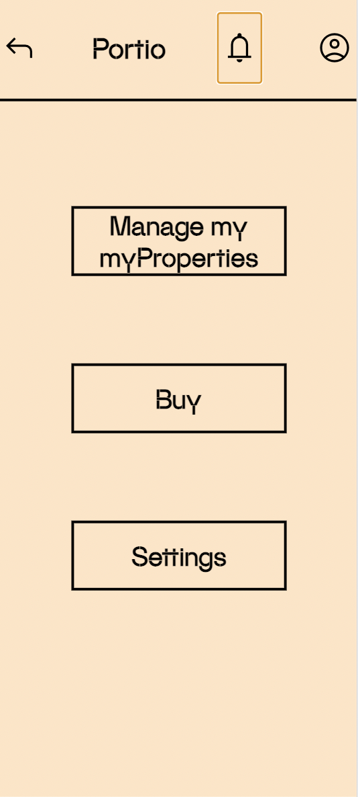
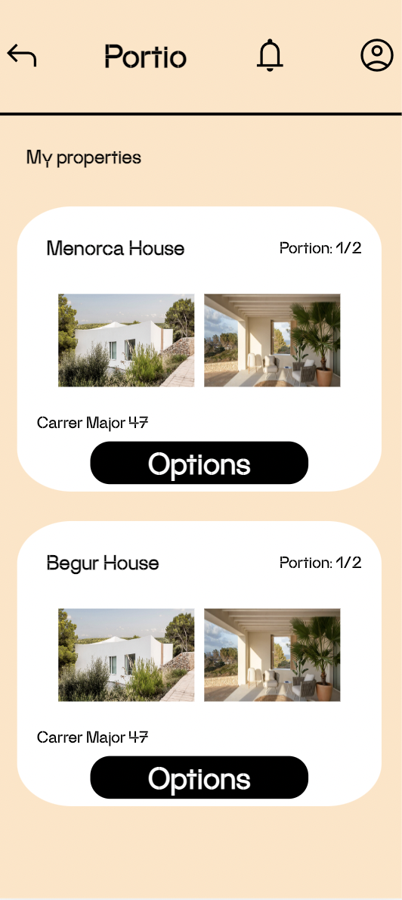
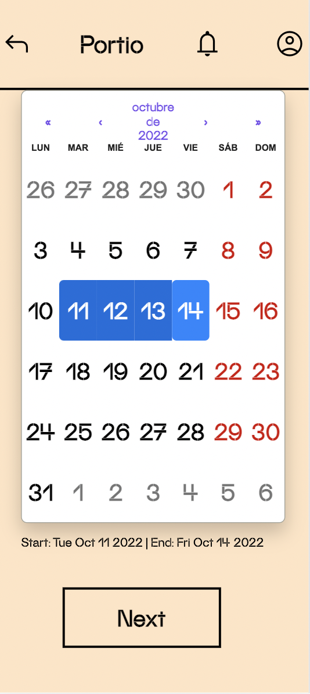
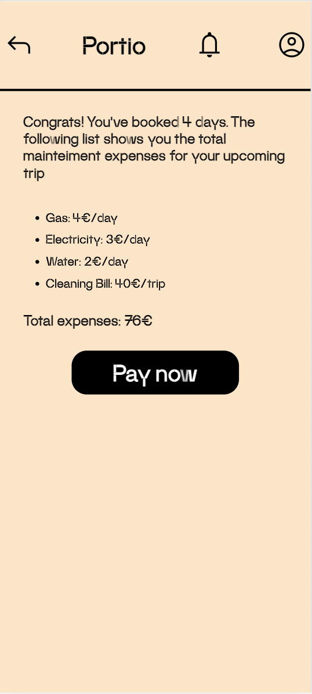
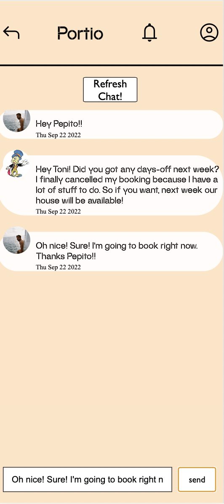
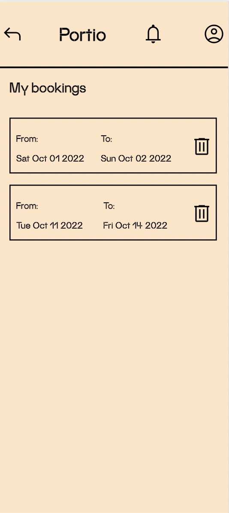

## Portio App

## Description

---

Let's be honest. Having a second residence is available to few. And not only because of the price of the house, but also because of the waste of money involved in maintaining it. And for what? To use it 30 days a year?

Well, this is where Portio was born. Buy portions of houses and pay only the portion that corresponds to you. Let's give an example: John, Claire, Paul and Daniel want to buy a second home on the Costa Brava. But nobody is willing to pay 200,000 euros, knowing that they won't take advantage of it all year because they all work in Barcelona. So Portio buys a house in Begur and sells 1/4 part to each one. Congratulations Claire! You are already an OWNER and you will be able to enjoy 1/4 of the year your new second residence. Likewise, you will not have to bear the maintenance costs alone. If after a few years Claire tires of the Costa Brava and decides to change the scene and buy a second home in the mountains, Claire will sell 1/4 of it.

5 years have passed and Claire has definitely gotten tired and she wants a change of scenery. Curiously, her portion, which she bought for €50,000, has now appreciated by €60,000!

## Functional Description

---

#### Use Cases

- User register/authentification
- Book a trip in a property that user owes
- Cancel bookings
- Check total invoices of your trip
- Chat with other owners that shares with user the same property

## Technologies

---

- React
- Express.js
- Node.js
- MongoDb

#### Data model

##### User

- Id (ObjectId)
- Name (String)
- Surname (String)
- Email (String)
- Password (String)
- Profile Picture (URL string)

##### Property

- Id (ObjectId)
- Title (String)
- Adress (String)
- Pictures (Array of URL strings)
- Portions (Array)
  - "n" objects
    - Owner (Object Id === userId)
    - Shares (number)
- Total Portions (number)

##### Booking

- Id (ObjectId)
- User (ObjectId === userId)
- Property (ObjectId === propertyId)
- State (String: "Active" || "Cancelled")
- Dates (Object)
  - From (Date)
  - To (Date)

##### Message

- Id (ObjectId)
- User (ObjectId)
- Property (ObjectId)
- Text (String)
- Sent At (Date)

foto

enlaces

